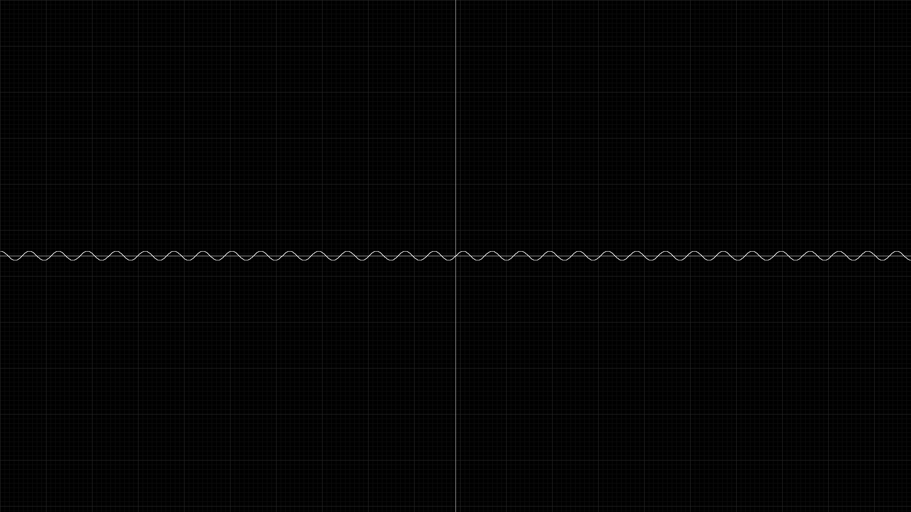
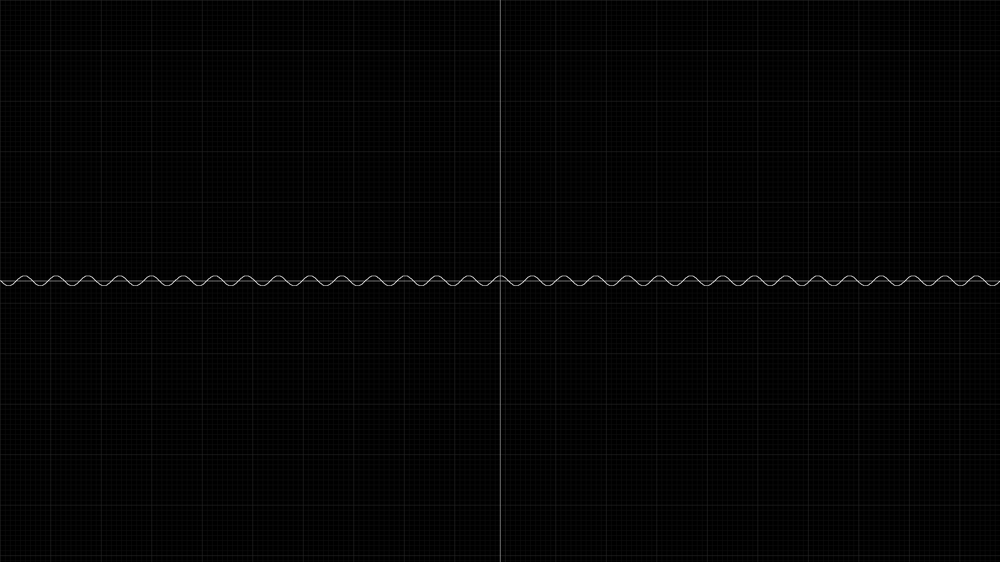
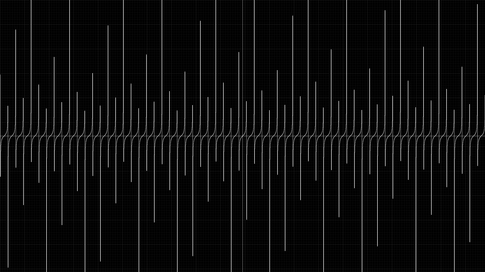
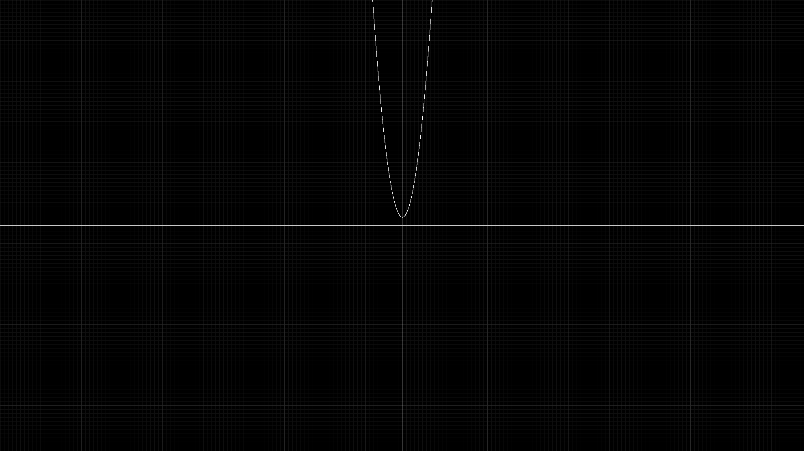

# Grafici Matematici in PPM

Questo progetto genera immagini in formato **PPM** di grafici matematici 2D, con **griglia cartesiana e tacche unità**. Include programmi per disegnare:

* **Parabola** (y = ax^2 + bx + c)
* **Seno** (y = \sin(x))
* **Coseno** (y = \cos(x))
* **Tangente** (y = \tan(x))

Tutte le funzioni sono disegnate in modo **continuo e analogico**, con griglia e assi centrati.

---

## Funzionalità principali

* **Griglia cartesiana**:

  * Assi X e Y centrati
  * Tacche delle unità (senza numeri)
  * Griglia principale e secondaria
* **Curve analogiche**:

  * Parabole e funzioni trigonometriche continue e lisce
  * Tacche unità visibili lungo gli assi
* Output in **PPM P6**, visualizzabile con qualsiasi visualizzatore compatibile

---

## Requisiti

* Compilatore C standard (es. `gcc`)
* Visualizzatore di immagini PPM (GIMP, IrfanView, ImageMagick…)

---

## Come compilare

```bash
gcc parabola.c -o parabola
gcc seno.c -o seno
gcc coseno.c -o coseno
gcc tangente.c -o tangente
```

---

## Come usare

### Parabola

```bash
./parabola a b c
```

* `a`, `b`, `c` = coefficienti della parabola (y = ax^2 + bx + c)
* Esempio:

```bash
./parabola 0.05 0 0   # y = 0.05x^2
./parabola 0.02 0.1 0 # y = 0.02x^2 + 0.1x
```

---

### Seno / Coseno / Tangente

```bash
./seno
./coseno
./tangente
```

* Non richiedono input.
* Disegnano rispettivamente le funzioni: (y = \sin(x)), (y = \cos(x)), (y = \tan(x)).
* Tutte le funzioni sono scalate automaticamente per rientrare nell’immagine.

---

## Output

* Ogni programma genera un file **`grafico.ppm`** nella cartella corrente.
* La griglia e gli assi sono centrati.
* Le curve sono continue, lisce e scalate proporzionalmente alla griglia.

---

## Note

* Per la parabola, usare coefficienti **adeguati alla griglia** (unità = 10 pixel) per evitare che la curva esca dallo schermo.
* La tangente può crescere molto rapidamente: le parti troppo grandi vengono troncate ai bordi dell’immagine.

---

## Seno

---
## Coseno

---
## Tangente

---
## Parabola



